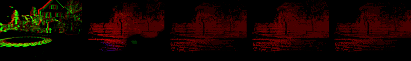

# SDformer-Flow: Spiking Neural Network Transformer for Event-based optical flow estimation


This code allows for the reproduction of our paper.
The following are results tested on our validation dataset on DSEC dataset. It shows events input, optical flow estimation by EVFlowNet, our STT-FlowNet, our SDformer-Flow and the ground truth data. Flow estimation are masked where valid ground truth data is available.

<!-- &nbsp; -->

<!-- &nbsp; -->

## Environment
It is recommended to use conda enviornment:
```
conda create -n SDformerflow python=3.7.3
conda activate SDformerflow
conda install requierments.txt
```
Install the dependencies:
```
conda install requierments.txt
```

For the spiking neural network,  we use [Spikingjelly](https://github.com/fangwei123456/spikingjelly) library version 0.0.0.0.14:

Install the latest version of Spikingjelly:
```
pip install spikingjelly
```
In `configs/`, you can find the configuration files associated to these scripts and vary the inference settings (e.g., number of input events, learning rate).

We use [Mlflow](https://www.mlflow.org/docs/latest/index.html#) to log the training process. 

## Inference

To estimate optical flow from event sequences from the MVSEC dataset and compute the average endpoint error and percentage of outliers, run:

```
python eval_DSEC_flow_SNN.py --config configs/valid_DSEC_Supervised.yml
```


## Training

Run:

```
python train_flow_parallel_supervised_SNN.py --config configs/train_DSEC_supervised_MS_Spikingformer.yml
```


[//]: # (## Related projects)

[//]: # (For event data preprocessing, refer to the following project:)

[//]: # ([Optical Flow estimation from Event Cameras and Spiking Neural Networks]&#40;https://github.com/j-cuadrado/of_ev_snn&#41;)

[//]: # ()
[//]: # (The spatial-temporal swin spikeformer module is adapted from the following project:)

[//]: # ([Video Swin Transformer]&#40;https://github.com/SwinTransformer/Video-Swin-Transformer&#41;)
